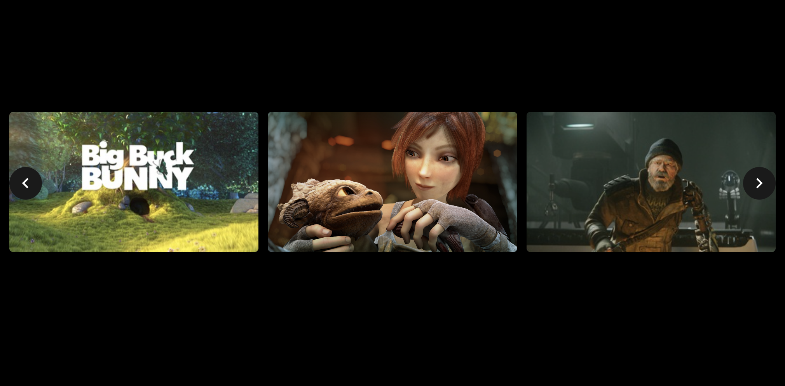

# Tile Slider

Performant and accessible React slider with virtualization.



## Introduction

`@videodock/tile-slider` is a React component of a performant and accessible slider written in React.
It only renders the visible tiles, meaning that you can have thousands of items and still get a good performance.

TileSlider is fully written using React and doesn't have dependencies. 

## Documentation

Visit the [documentation](https://videodock.github.io/tile-slider/) with examples

Using v1, see the [v1 branch](https://github.com/Videodock/tile-slider/tree/v1).

## Features

- Virtualized rendering
- Custom pagination
- Custom controls
- Custom slide transition
- Fully responsive using CSS
- Accessible
- First-class TypeScript support 

## Requirements

- react >= 17
- react-dom >= 17

## Installation

Install this package via (P)NPM or Yarn: 

```shell
$ yarn add @videodock/tile-slider
$ npm install @videodock/tile-slider
$ pnpm install @videodock/tile-slider
```

## Example usage

> Important: .css file import requirement (version 1.0.1 and above)
> Starting from version `1.0.1`, it's crucial to include the `.css` import explicitly, as demonstrated in the example below:

```tsx
import { TileSlider, CYCLE_MODE_RESTART } from '@videodock/tile-slider';
import '@videodock/tile-slider/lib/style.css';

type Data = { title: string; imageUrl: string };

const items: Data[] = Array.from({ length: 1000 }).map((_, index) => ({
  title: `Item #${index + 1}`,
  imageUrl: 'https://via.placeholder.com/350x150',
}));

const App: React.FC = () => {
  return (
    <TileSlider<Data>
      items={items}
      tilesToShow={6}
      spacing={8}
      cycleMode={CYCLE_MODE_RESTART}
      renderLeftControl={({ onClick, disabled }) => (
        <button onClick={onClick} disabled={disabled}>
          Slide left
        </button>
      )}
      renderRightControl={({ onClick, disabled }) => (
        <button onClick={onClick} disabled={disabled}>
          Slide right
        </button>
      )}
      renderTile={({ item, isVisible }) => {
        // you can do further performance optimizations for tiles that are not visible.
        return () => (
          <div style={{ width: 350, height: 120, backgroundImage: `url(${item.imageUrl})` }}>
            <p>{item.title}</p>
          </div>
        );
      }}
    />
  );
};

export default App;
```

## Documentation

Run the documentation app, which showcases all features of the TileSlider package:

```shell
cd docs
yarn
yarn start
```
